# Jahrgang

**[Spielen](https://jahrgang.vercel.app)**

Ein Titel läuft. Name und Jahr bleiben verdeckt. Du ordnest ihn auf deiner Zeitlinie ein: links früher, rechts später. Wer zuerst alle Karten richtig liegen hat, gewinnt.

Keine Anmeldung. Läuft im Browser auf Handy und Rechner.

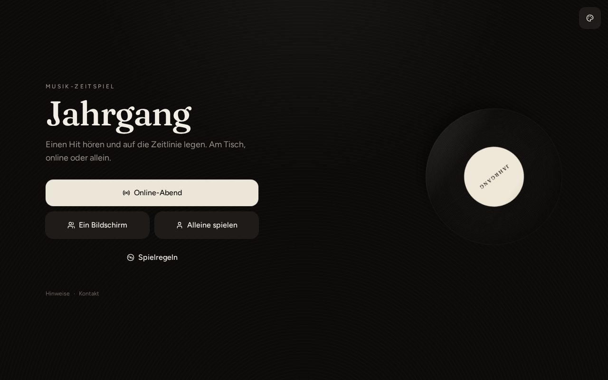

## Handy

Die Auswahl klappt als Blatt von unten auf. Spiel, Stil und Genre liegen als ganze Liste da, nicht als winzige Chips.

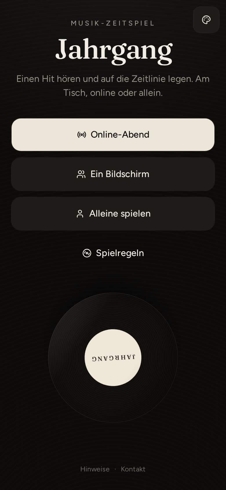

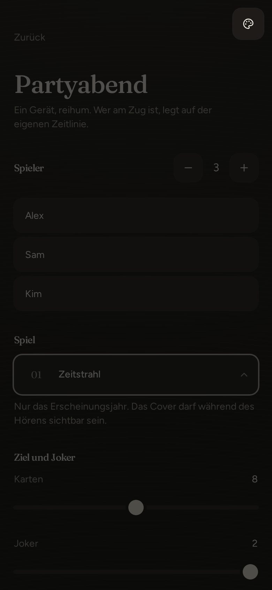

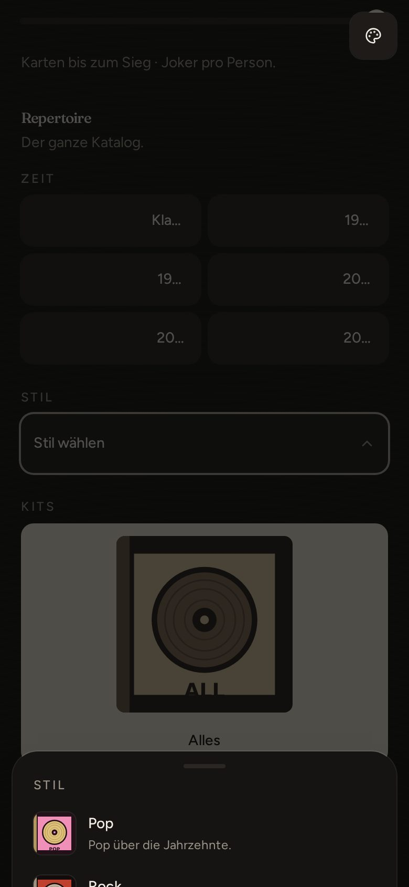

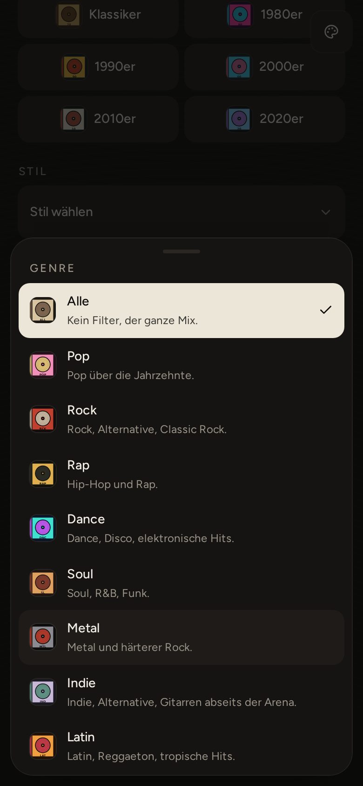

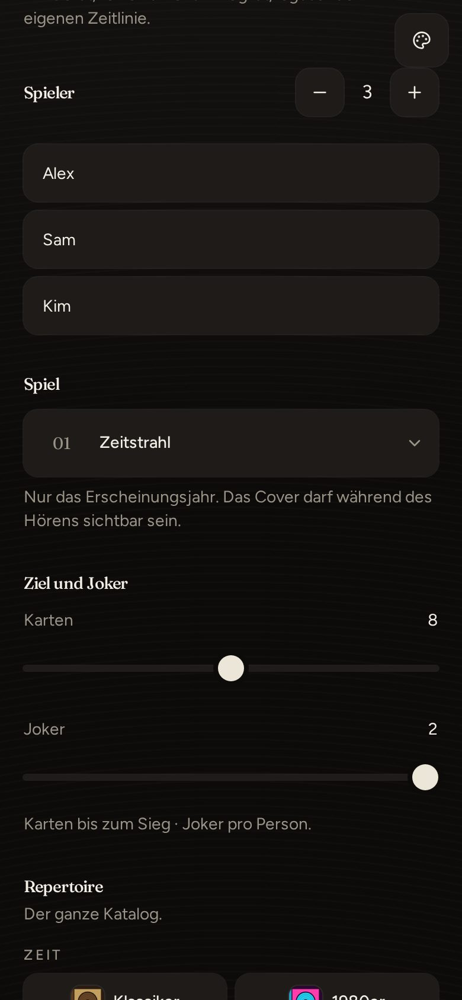

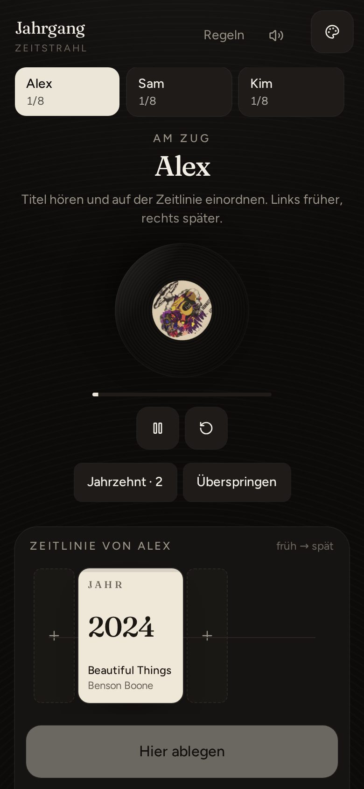

## Rechner

Auf dem großen Schirm stehen Namen links, Repertoire rechts. Jedes Pack hat ein kleines Cover am Knopf. Modi haben Name und Kurztext.

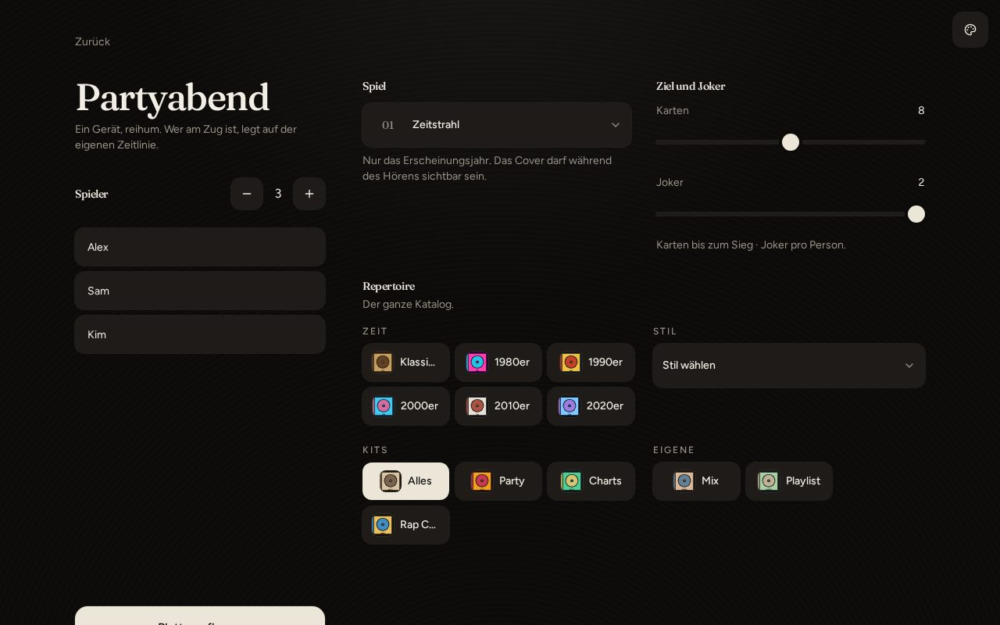

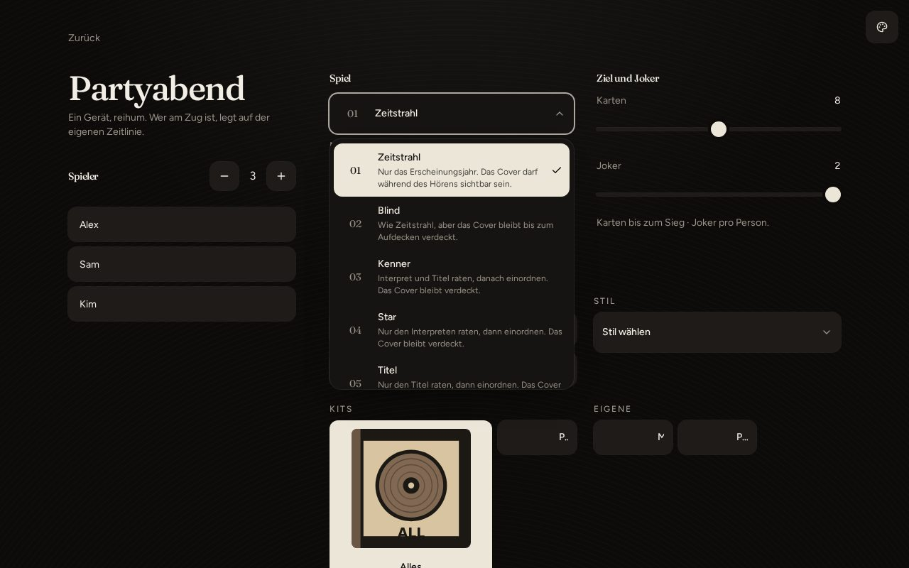

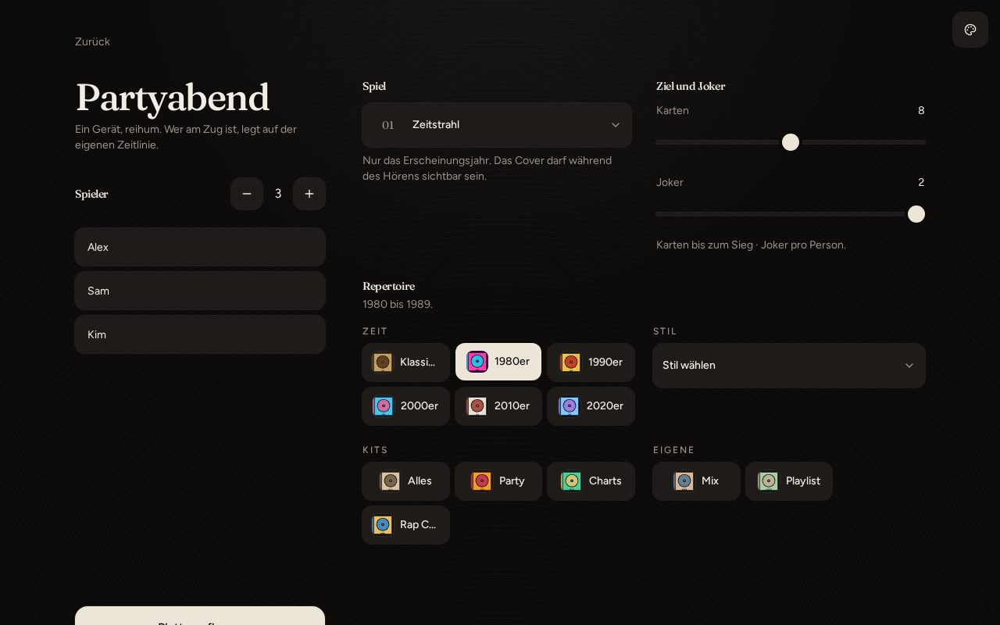

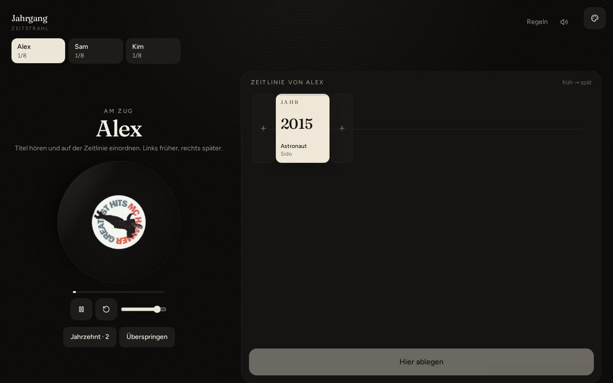

## So wird gespielt

Jede Person beginnt mit einer offenen Karte. Dann kommt ein neuer Titel. Du hörst ihn und wählst den Platz auf deiner Zeitlinie. Sitzt die Lage, bleibt die Karte. Liegt sie falsch, geht sie zurück.

| Modus | Ablauf |
| --- | --- |
| Zeitstrahl | Nur das Erscheinungsjahr. Cover darf sichtbar sein. |
| Blind | Wie Zeitstrahl, Cover bleibt zu. |
| Kenner | Interpret und Titel raten, dann einordnen. |
| Star | Nur den Interpreten raten. |
| Titel | Nur den Songtitel raten. |
| Verrückter | Kenner, Cover zu, Jahre weg, links ist später. Die Platte läuft zu schnell oder zu langsam. |

Joker nach Einstellung: keine, eine oder zwei. Damit lässt sich das Jahrzehnt anzeigen oder der Titel überspringen.

Ziel sind 6, 8 oder 10 Karten. Repertoire als Pack: Jahrzehnt, Stil, Party, Charts, Rap Charts. Mix aus Zeitraum plus Genre. Oder eine öffentliche Spotify- bzw. Deezer-Playlist.

## Mit anderen spielen

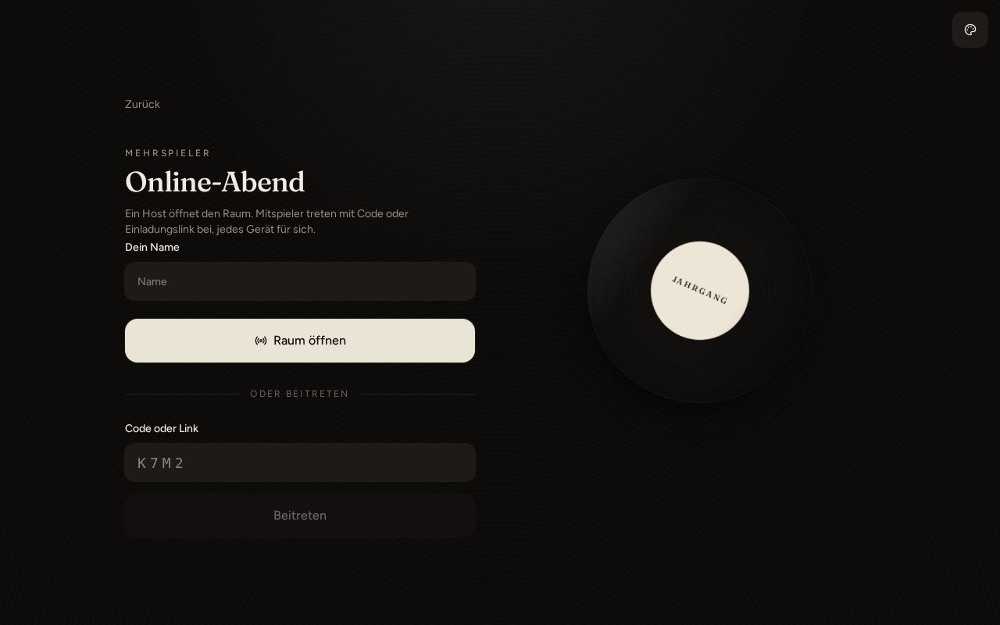

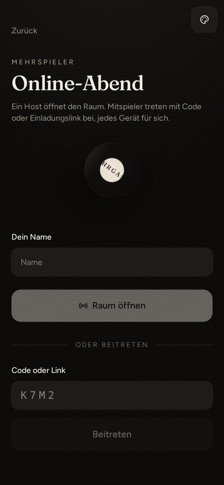

1. Eine Person öffnet [jahrgang.vercel.app](https://jahrgang.vercel.app) und wählt **Online-Abend**.
2. Namen eingeben, **Raum öffnen**.
3. Den Code oder den Link an die Runde schicken.
4. Die anderen treten bei.
5. Der Host wählt Spiel, Repertoire und ob nur der Host oder alle die nächste Runde starten dürfen.

Nur wer am Zug ist, legt. Alle hören denselben Titel. Bis zu acht Personen.

## Ein Bildschirm oder Solo

**Ein Bildschirm:** ein Gerät, reihum. Gut für denselben Tisch.

**Solo:** eine Zeitlinie, drei Fehlversuche.

## Hinweise

Ohne Internet keine Vorschau und keine Online-Runde. Code ohne Null und Eins vorlesen.

Kleine Tippfehler beim Raten sind in Ordnung. „Beatles“ zählt für The Beatles, „YMCA“ für Y.M.C.A.

Jahrgang ist ein eigenes Spiel, keine Lizenz eines anderen Gesellschaftsspiels. Es erzielt keinen Gewinn. Rechtliches an [jahrgang.game@icloud.com](mailto:jahrgang.game@icloud.com).

## Entwicklung

```bash
git clone https://github.com/Linopix/Jahrgang.git
cd Jahrgang
npm install
npm run dev
```

Node 22. Die App läuft unter `http://localhost:8080`.
