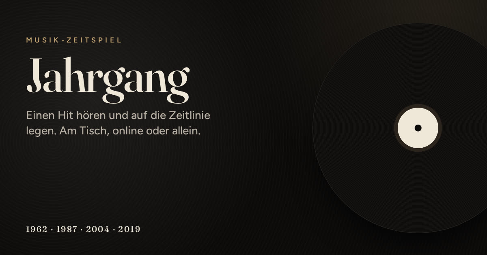
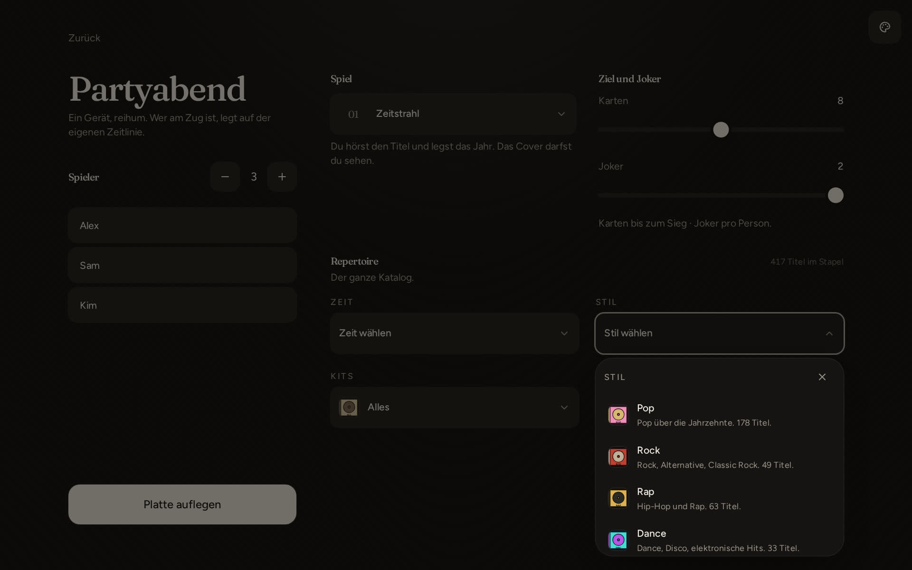

<p align="center">
  
</p>

<h1 align="center">Jahrgang</h1>

<p align="center">
  Einen Hit hören und auf die Zeitlinie legen.<br />
  Links früher, rechts später.
</p>

<p align="center">
  <a href="https://jahrgang.vercel.app"><strong>Spielen</strong></a>
  · Handy und Rechner · ohne Anmeldung
</p>

<p align="center">
  
</p>

<table>
  <tr>
    <td width="38%" valign="top">
      
    </td>
    <td width="62%" valign="top">
      
    </td>
  </tr>
</table>

## Spielmodi

| Spiel | Ablauf |
| --- | --- |
| Kenner | Interpret und Titel können angegeben werden. Beides richtig: Cover und ein Joker. |
| Zeitstrahl | Nur das Jahr. Cover ist sichtbar. |
| Blind | Wie Zeitstrahl, Cover bleibt verdeckt. |
| Star | Nur den Interpreten angeben, dann legen. |
| Titel | Nur den Songtitel angeben, dann legen. |
| Verrückter | Raten, Cover verdeckt, keine Jahreszahlen auf der Linie, links ist später. Wiedergabe schneller. |
| Custom | Raten, Cover, Linienrichtung, Tempo und Ziel werden einzeln eingestellt. |

Repertoire: Jahrzehnt, Stil, Party, Charts. Mix und Playlist liegen außerhalb dieser Liste (Zeitraum/Genre bzw. öffentliche Spotify- oder Deezer-Liste). Beim Einfügen einer Playlist wird geprüft, für wie viele Titel eine Hörprobe erreichbar ist.

<table>
  <tr>
    <td></td>
    <td></td>
  </tr>
  <tr>
    <td></td>
    <td></td>
  </tr>
</table>

## Mit anderen

Eine Person öffnet den Raum, die anderen kommen mit Code oder Link. Bis zu acht Geräte. Nur wer am Zug ist, legt. Alle hören denselben Titel.

Der Host stellt ein, wer die nächste Runde startet, und ob Chat und Emoji an sind.

<table>
  <tr>
    <td width="62%"></td>
    <td width="38%"></td>
  </tr>
</table>

**Ein Bildschirm:** ein Gerät, reihum, am selben Tisch.

**Alleine:** eine Linie, drei Fehler.

## Lokal

```bash
git clone https://github.com/Linopix/Jahrgang.git
cd Jahrgang
npm install
npm run dev
```

Node 22, dann [localhost:8080](http://localhost:8080). Ohne Netz keine Vorschau und keine Online-Runde.

Am Code arbeiten: **[docs/entwicklung.md](docs/entwicklung.md)** (Landkarte) und **[docs/voraussetzungen.md](docs/voraussetzungen.md)** (was du können solltest).

Kleine Tippfehler beim Raten sind in Ordnung. „Beatles“ zählt für The Beatles.

## Musikdienste

Spielen braucht kein Konto. iTunes und Deezer liefern die Kurzvorschau. Eine öffentliche Playlist kann als zusätzlicher Stapel dienen; beim Einfügen wird gezählt, für wie viele Titel eine Hörprobe vorliegt. Alle zwölf Stunden werden aktuelle Charts ergänzt.

Spotify ist optional und nutzt das Konto der spielenden Person: Likes, Playlists und Top-Titel werden den passenden Packs zugeordnet. Mit Premium laufen volle Titel auf dem Gerät, das gerade spielt. Ohne Premium bleibt Online, Wohnzimmer und Discord nutzbar.

Einrichtung, Flag, Redirects, und warum Apple Music kein kleiner Schalter ist: **[docs/musikdienste.md](docs/musikdienste.md)**.

## Hinweise

Jahrgang ist ein eigenes Spiel, keine Lizenz von irgendwem, und verdient nichts. Der Code steht unter MIT. Fragen an [jahrgang.game@icloud.com](mailto:jahrgang.game@icloud.com).
