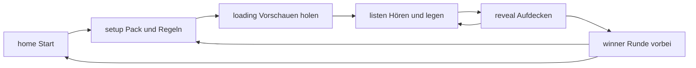

# Jahrgang entwickeln

Du willst am Code arbeiten und weißt noch nicht, wo was liegt. Das hier ist die Landkarte.

Jahrgang ist ein Musik-Jahr-Quiz im Browser: einen Hit hören, auf die Zeitlinie legen. Links früher, rechts später. Es gibt Solo, einen Tisch (ein Gerät) und Online (jedes Gerät ein Spieler). Optional ein Wohnzimmer: Fernseher oder Discord-Stream als Bühne, Handys als Controller.

Keine Anmeldung nötig. Kein Backend für den Spielstand. Online läuft **Gerät zu Gerät** (WebRTC). Der Server kennt nur den Raumcode, damit sich die Browser finden.

Der Rest dieser Datei ist für Menschen, die TypeScript schon mal gesehen haben. Du musst kein React-Profi sein. Was du können solltest, steht getrennt in **[voraussetzungen.md](voraussetzungen.md)**.

---

## In fünf Minuten loslegen

```bash
git clone https://github.com/Linopix/Jahrgang.git
cd Jahrgang
npm install
npm run dev
```

Node 22. Dann [http://127.0.0.1:8080](http://127.0.0.1:8080) — nicht `localhost`, Spotify und manches Mobilgerät mögen das nicht.

| Befehl | Wofür |
| --- | --- |
| `npm run dev` | Spiel lokal, lädt bei Dateiänderung neu |
| `npx tsc --noEmit` | Typen prüfen, schnellster Smoke-Test |
| `node --experimental-strip-types --test src/lib/game/*.test.ts src/lib/tv/tv.test.ts src/lib/spotify/spotify.test.ts src/lib/og/invite.test.ts` | Spielregeln, Packs, Online, Einladungsbild |
| `npm test` | Dieselben Spiele-Tests plus ein paar Gerüst-Checks |
| `npm run build` | Produktionsbuild |

UI-Texte sind Deutsch. Variablen und Dateinamen sind Englisch. Keine Emojis im Produkttext (Reaktionen im Spiel sind Absicht).

---

## Das Bild im Kopf

Drei Speicher, drei Jobs. Wenn du das hast, findest du fast jeden Bug.

```
  Bildschirm  ──liest──►  useGame / useOnline / useSessionExit
       ▲                         │
       │                    Aktionen
       │                         ▼
  PlayScreen u. a.  ──ruft──►  requestPlace, requestSelectSlot, …
                                    │
                         lokal: useGame.confirmPlacement
                         online: Nachricht an den Host
                                    │
                         Host rechnet ──► snapshot ──► alle Geräte
```

| Store | Datei | Job |
| --- | --- | --- |
| `useGame` | [`src/lib/game/store.ts`](../src/lib/game/store.ts) | Die Runde: Stapel, wer dran ist, Linie, Aufdecken |
| `useOnline` | [`src/lib/game/online-store.ts`](../src/lib/game/online-store.ts) | Der Raum: Code, Host, Gäste, Pack, TV |
| `useSessionExit` | [`src/lib/game/session-exit.ts`](../src/lib/game/session-exit.ts) | Wer geht oder den Abend beendet: eigene Stats, Podest |

Die UI **ändert den Spielstand nicht selbst**. Buttons rufen `request…` in [`online-actions.ts`](../src/lib/game/online-actions.ts). Offline führt das direkt `useGame` aus. Online darf nur der **Host** rechnen; Gäste schicken eine Nachricht, der Host antwortet mit dem ganzen Stand (`{ t: "state", snapshot }`).

Darum: Regel ändern → `store.ts` / `engine.ts`. Netz ändern → `protocol.ts` / `online-bridge.tsx`. Knopf ändern → Screen unter `src/components/game/`.

---

## Eine Runde, Schritt für Schritt

`useGame.phase` sagt, welcher Bildschirm sichtbar ist. [`app.tsx`](../src/components/game/app.tsx) schaltet danach um.



| Phase | Screen | Was passiert |
| --- | --- | --- |
| `home` | `home-screen.tsx` | Start, Online, Wohnzimmer, Regeln, Theme |
| `setup` | `setup-screen.tsx` | Namen, Modus, Karten, Packs |
| `loading` | `loading-screen.tsx` | 30-Sekunden-Vorschau bei iTunes/Deezer suchen |
| `listen` | `play-screen.tsx` | Aktueller Titel, Zeitlinie, Joker, Raten |
| `reveal` | `reveal-screen.tsx` | Richtig/falsch, Cover, Jahr |
| `winner` | `winner-screen.tsx` | Podest der Runde, nächste Runde, Abend beenden |

Online dazwischen: `entry` → `connecting` → `lobby` → `playing`. Solange `useOnline.status` nicht `off` oder `playing` ist, siehst du Lobby statt Spiel.

**Zug**

1. Jeder startet mit **einer** offenen Karte auf der Linie.
2. Der Rest ist der **Stapel** (`deck`). `current` ist die Karte oben.
3. Wer dran ist, wählt einen Schlitz (`selectSlot` / `{ t: "aim" }` für Zuschauer).
4. `confirmPlacement`: Jahr passt zwischen Nachbarn? Dann bleibt die Karte. Sonst wandert sie **unter** den Stapel.
5. Überspringen (Joker) ebenso: aktuelle Karte nach unten, nächste oben.
6. Jahrzehnt-Joker: Karte bleibt, du siehst nur die Dekade.
7. Ziel zählt Karten **auf der Linie**, nicht wie oft der Stapel umgeschlagen hat.
8. Linie voll oder Stapel leer → `winner`.

Die pure Regel (ohne React) steht in [`engine.ts`](../src/lib/game/engine.ts): `canPlace`, `dealCount`, `winner`, `rankPlayers`. Tests in [`engine.test.ts`](../src/lib/game/engine.test.ts).

---

## Ordner

```
src/
  routes/                 Seiten und API (TanStack Start, dateibasiert)
    index.tsx             Spiel
    i.$code.tsx           Einladungslink /i/AB12
    hinweise.tsx          Impressum / Kontakt
    api/rtc.ts            WebRTC-Vermittlung
    api/spotify*.ts       Optionaler Spotify-Login
    api/og.ts             Vorschaubild für Links
  components/game/        Alles was du siehst
  lib/game/               Spielkern (Start hier)
  lib/multiplayer/        WebRTC-Mesh
  lib/tv/                 Wohnzimmer / Discord-Bühne
  lib/spotify/            Optional, hinter SPOTIFY_LIVE
  lib/og/                 Einladungsbilder
  styles.css              Farben, Themes, Bewegung
docs/
  entwicklung.md          diese Datei
  voraussetzungen.md      was du können solltest
  musikdienste.md         Spotify und andere Dienste
```

`src/lib/auth`, `src/lib/account`, `migrations/` gehören zum App-Gerüst. Konten sind **aus** (`ACCOUNT_LIVE = false`). Daran musst du fürs Spiel nicht arbeiten. Spotify-Dateien bleiben, auch wenn `SPOTIFY_LIVE` gerade `false` ist — das Feature ist nur zugeklappt.

Ein paar Dateien (`PreviewHostBridge`, `scripts/with-app-env.mjs`) kommen noch aus der Vorschau-Umgebung. Außerhalb davon tun sie nichts Böses. Nicht löschen, nur weil der Name fremd klingt. Die Grok-Install-Seite und die Skills-Ordner gehören nicht zum Spiel und sind nicht im Repo.

---

## Audio, Raten, Reaktionen

| Thema | Datei | Kurz |
| --- | --- | --- |
| Nadel und UI-Klänge | [`audio.ts`](../src/lib/game/audio.ts), [`public/sfx/`](../public/sfx/) | Preview ist ein `HTMLAudioElement`. Vinyl-Start, falsch, Joker liegen als mp3. Lobby-Musik ist synthetisch (Web Audio), kein Streaming. |
| Tipp vergleichen | [`guess.ts`](../src/lib/game/guess.ts) | Kleine Tippfehler, „The Beatles“ / „Beatles“, Klammern. Kenner darf leer lassen (überspringen). |
| Autocomplete | [`guess-field.tsx`](../src/components/game/guess-field.tsx) | Vorschläge aus dem Katalog. Steht ein Interpret, zeigt der Titel nur Songs **dieses** Interpreten. |
| Reaktionen | [`reactions.ts`](../src/lib/game/reactions.ts), [`reaction-dock.tsx`](../src/components/game/reaction-dock.tsx) | `{ t: "react" }`. Host kann Emoji in der Lobby aus. |
| Chat | [`chat.ts`](../src/lib/game/chat.ts) | `{ t: "chat" }` / `chat-del`. Filter: `moderation.ts`. |
| Raumcode | [`room-code.ts`](../src/lib/game/room-code.ts) | Vier Zeichen, ohne 0/O/1/I. Link `/i/AB12`. `?host=1` ist der Claim fürs Wohnzimmer-Handy. |
| Einladungsbild | [`src/lib/og/`](../src/lib/og/) | Startseite ≠ Raum.link. Discord/WhatsApp holen `/api/og`. |
| Discord-Overlay | [`discord/presence.ts`](../src/lib/discord/presence.ts) | Nur wenn das Spiel in Discord steckt. Setzt Rich Presence, ändert keine Regeln. |

---

## Typen, die du oft triffst

Alles Wichtige in [`types.ts`](../src/lib/game/types.ts).

| Name | Bedeutung |
| --- | --- |
| `CatalogSong` | Titel, Interpret, Jahr, optional `german` |
| `ResolvedSong` | plus `previewUrl` (ohne die spielt die Nadel nicht) |
| `Player` | `timeline`, `tokens` (Joker), `misses`, `quiz` |
| `PlayVariant` | Kenner, Zeitstrahl, Blind, … |
| `EraId` | Ein Pack: `eighties`, `pop`, `likes`, … |
| `RoomConfig` | Was die Lobby einstellt und der Host sendet |
| `GameSnapshot` | Kompletter Rundstand, geht übers Netz |
| `Phase` | Siehe Tabelle oben |

**Modi** (`VARIANT_IDS`, Reihenfolge = Menü):

| id | Label | Kurz |
| --- | --- | --- |
| `original` | Kenner (01) | Interpret + Titel optional. Beides richtig: Cover und ein Joker. Standard 0 Joker, Ziel 10 |
| `timeline` | Zeitstrahl | Nur legen, Cover an |
| `blind` | Blind | Wie Zeitstrahl, Cover zu |
| `star` | Star | Nur Interpret |
| `hook` | Titel | Nur Songtitel |
| `wild` | Verrückter | Alles verdreht, Tempo spinnt |
| `custom` | Custom | Schalter statt fertigem Satz |

`rulesFor(variant, custom)` macht daraus `guess`, `hideCover`, `reverse`, `open`, … Nicht in der UI nachbauen — immer diese Funktion.

---

## Katalog und Packs

Der Katalog ist eine lange Liste in [`catalog.ts`](../src/lib/game/catalog.ts):

```ts
["Bohemian Rhapsody", "Queen", 1975],
["Autobahn", "Kraftwerk", 1974, 1],  // 1 = deutschsprachig
```

Daraus wird `CATALOG` mit einer `id` aus Titel+Interpret+Jahr. Genre steht nicht an der Zeile. [`packs.ts`](../src/lib/game/packs.ts) rät das Genre über Interpreten-Listen (`METAL_ARTISTS`, `SOUL_ARTISTS`, …) plus `song.genre`, falls gesetzt.

**Packs kombinieren:** `RoomConfig.eras` ist die Liste, erste Stelle ist das Leitpack. `era` / `extraEra` bleiben für ältere Clients. `parseEras` / `packPatch` halten das synchron. Maximal vier. Pack `all` bleibt allein (der ganze Katalog).

Beim Start mischt `startGame` in `store.ts`:

1. Songs aus den gewählten Packs
2. Playlist-Import, Spotify-Bibliothek, frische Charts (`fresh.ts`, alle 12 Stunden)
3. Doppelte raus
4. Nur Titel **mit** Preview ins Deck (sonst stumme Runde)

Reicht der Haufen nicht für Spieler × (Ziel + 1), warnt die Lobby (`pileStatus`).

---

## Online, ohne Server-Schiedsrichter

```
Handy A  ←──WebRTC──►  Handy B
   ▲                      ▲
   └── kurz /api/rtc ─────┘   (nur „wer ist im Raum“, SDP, ICE)
```

Sobald die DataChannels stehen, fließt das Spiel **nicht** mehr über den Server. Der Host ist die Quelle der Wahrheit.

1. Host erzeugt vierstelligen Code, `selfId` bleibt in `sessionStorage` (`seat.ts`).
2. Gäste pollen `/api/rtc`, tauschen Offer/Answer.
3. `hello` → Host schickt `lobby` (Werkliste + Einstellungen).
4. Start: Host lädt Vorschauen, sendet `state`.
5. Gast legt: `{ t: "action", kind: "place", slot, title?, artist? }`.
6. Host führt `confirmPlacement` aus, sendet neuen `snapshot`.
7. Zuschauer sehen den Zielschlitz live über `{ t: "aim", slot }`.

Nachrichten: [`protocol.ts`](../src/lib/game/protocol.ts). Empfang und Host-Logik: [`online-bridge.tsx`](../src/components/game/online-bridge.tsx). Senden: [`net.ts`](../src/lib/game/net.ts) (ein `send`, vom Mesh gebunden).

**Host weg**

- 12 Sekunden Gnade (`HOST_GRACE_MS`), gleicher `selfId` → wieder da.
- Danach nimmt der nächste lebende Nicht-TV-Spieler (`pickSuccessor` in `tv/names.ts`, `shouldTakeHost` in `hosting.ts`).
- `{ t: "host-take" }`, alter Host wird Gast sobald er `lobby` mit fremder `hostId` sieht.

TV wird nie Host-Nachfolger, außer niemand anderes lebt.

**Chat / Namen:** [`moderation.ts`](../src/lib/game/moderation.ts) filtert auf Senden *und* Empfangen (Peers sind fremd). Host darf fremde Zeilen löschen (`chat-del`).

---

## Wohnzimmer / Discord

`TV_LIVE` ist an. „Wohnzimmer“ auf der Startseite: dieses Gerät ist die **Bühne** (`role: "host"`, Name „Fernseher“).

| Schritt | Bedeutung |
| --- | --- |
| `claim` | Kurzer QR: erstes Handy wird Admin |
| `setup` | Pack und Regeln (am Handy, oder an der Bühne wenn übersprungen) |
| `invite` | Gäste-QR |

`adminId` ≠ `hostId` ist normal: der Fernseher hält den Mesh, das Handy stellt ein. `stagePlays`: Bühne sitzt mit am Tisch. Sonst zählt der Fernseher nicht als Spieler (`playerSeats`).

Auf der Bühne: `tv-stage.tsx` (große Platte, fremde Linie). Am Handy: normales Play, ohne dass du deine eigene Linie als „Zuschauer“ siehst.

---

## Screens und wer sie steuert

[`app.tsx`](../src/components/game/app.tsx) ist der einzige Umschalter. Neue Ansicht? Phase oder `online.status` erweitern, dann hier einhängen — nicht irgendwo `window.location`.

Einstellungen der Runde: [`game-options.tsx`](../src/components/game/game-options.tsx) (Solo-Setup und Online-Lobby teilen sich das). Pack-Liste, Ziel-Slider, Custom-Schalter leben dort.

Bewegung und Farben: [`styles.css`](../src/styles.css). Themes in [`theme.ts`](../src/lib/theme.ts), `data-theme` am `<html>`. Tokens wie `bg-raised`, `text-muted`, `shadow-border`, `ease-soft` — keine Magenta-Akzente, keine neuen Schatten erfinden.

---

## Feature-Schalter

Kleine Dateien, große Wirkung. Nicht „heimlich“ im UI verstecken.

| Flag | Datei | Default | Bedeutung |
| --- | --- | --- | --- |
| `SPOTIFY_LIVE` | `src/lib/spotify/flags.ts` | `false` | Login, Likes-Pack, Premium-Wiedergabe |
| `TV_LIVE` | `src/lib/tv/flags.ts` | `true` | Wohnzimmer |
| `ACCOUNT_LIVE` | `src/lib/account/flags.ts` | `false` | Konto / Rangliste |

Spotify einrichten: **[musikdienste.md](musikdienste.md)**. Ohne Flag bleibt der Abend gleich (iTunes + Deezer).

---

## Versteckte Dinge (kein Menüpunkt)

| Eingabe | Effekt |
| --- | --- |
| `nadel` tippen, nicht in einem Feld | Debug-Overlay: `selfId`, Peers, ICE, RTT, letzte Nachrichten |
| Konami oder das Wort `konami` | Theme „Disco“ |
| Debug-Code | [`debug.ts`](../src/lib/game/debug.ts), Overlay [`debug-overlay.tsx`](../src/components/game/debug-overlay.tsx) |

---

## Rezepte

### Song in den Katalog

In `catalog.ts` eine Zeile in `ROWS`:

```ts
["Titel", "Interpret", 1997],
["Deutscher Titel", "Interpret", 1983, 1],
```

Jahr = Erscheinungsjahr, nach dem gelegt wird. Deutsch-Flag nur bei deutschsprachig. Genre kommt meist über den Interpreten in `packs.ts`. Danach `npx tsc --noEmit` — IDs entstehen automatisch. Ohne Treffer bei iTunes/Deezer fliegt der Titel beim Start wieder raus.

### Pack oder Genre

1. `EraId` in `types.ts` (und Label/Blurb/`PACK_GROUPS`).
2. Filter in `songFitsPack` (`packs.ts`).
3. Bei Genre: Interpreten in die passende `*_ARTISTS`-Menge oder `song.genre` am Katalogeintrag.

UI zieht Packs aus `PACK_GROUPS`. Kein zweites Menü bauen.

### Spielmodus

1. Wert in `PlayVariant` und `VARIANT_IDS` (Reihenfolge = Nummer im Menü).
2. Label/Blurb.
3. Zweig in `rulesFor`.
4. Kenner-Extras (Joker verdienen, Cover nach richtigem Tipp) liegen in `store.ts` / `guess.ts`, nicht in der UI.

### Netz-Nachricht

1. Variante in `OnlineMessage` (`protocol.ts`) und `KINDS`.
2. Host- oder Gast-Zweig in `online-bridge.tsx`.
3. Senden über `netSend` / `online-actions.ts`.
4. Test in `protocol.test.ts`, wenn die Form Teil des Vertrags ist.

Snapshot möglichst klein halten: `GameSnapshot` geht bei jedem Zug an alle.

### Styling

Bestehende Komponenten anfassen (`button.tsx`, `menu-select.tsx`). Keine neue Farbwelt. Hover: leicht nach oben, Active: `scale-[0.96]`, Dauer ~150–200 ms, `ease-soft`.

---

## Tests, die wirklich das Spiel treffen

`npm test` prüft Spiel und ein paar Gerüst-Dateien. Explizit:

```bash
npx tsc --noEmit
npm test
```

Datei neben der Logik: `engine.ts` → `engine.test.ts`. Kein extra Runner, kein Vitest.

Wenn du `canPlace`, Zielkarten oder Host-Nachfolge anfasst: Test zuerst oder direkt mit dazu.

---

## Typische Fallen

**„Die Runde endet nach vier Karten.“**  
Deck zu klein. `dealCount` braucht grob `Spieler × (Ziel + 1)`. Packs mischen oder Custom-Stapel größer stellen — nicht „einfach weiterziehen“.

**„Host am Handy ist nicht Host.“**  
Im Wohnzimmer ist der Fernseher Mesh-Host. Admin ist das erste Handy (`adminId`). Rechte übergeben: `pass-admin`.

**„Nach Reload bin ich ein neuer Spieler.“**  
`selfId` sitzt in `sessionStorage` (`jahrgang-seat`), 45 Minuten. Anderer Browser / privates Fenster = neuer Platz.

**„Vorschau fehlt.“**  
Kein Treffer bei iTunes/Deezer (manchmal Spotify-Suche, wenn Flag an). Der Titel kommt nicht ins Deck. Das ist Absicht.

**„Gäste sehen einen anderen Stand.“**  
Irgendwer hat `useGame.setState` auf dem Gast angefasst. Nur der Host rechnet, alle anderen nehmen `snapshot`.

**Zwei Pack-Felder.**  
Alte Clients senden `era` + `extraEra`. Neue senden zusätzlich `eras[]`. Immer `parseEras(...)` lesen, nie nur ein Feld.

---

## API-Routen (kurz)

| Pfad | Rolle |
| --- | --- |
| `GET/POST /api/rtc` | Peers und Signale, TTL ~30 s |
| `/api/spotify/login` `callback` `token` | OAuth, nur wenn Flag an |
| `/api/og` | PNG für WhatsApp/Discord, Einladung vs. Startseite |

Kein `/api/game`. Kein Websocket für Züge.

---

## Sprache und Ton

Spieler sehen Du-Form, kurze Sätze, keine Marketing-Floskeln. Fehlermeldungen sagen, was zu tun ist („Anderes Pack oder Mix weiter stellen“), nicht „Error 500“.

Commit-Nachrichten bisher auf Deutsch, ein Satz was der Spieler merkt, optional ein zweiter Satz warum.

Fragen zum Spiel, nicht zum Code: [jahrgang.game@icloud.com](mailto:jahrgang.game@icloud.com). Lizenz MIT.
